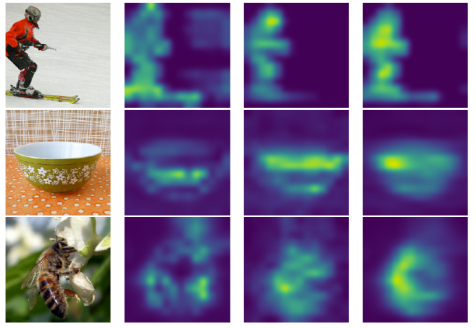

# Evolving Attention Model

This repository contains the implementation of the model proposed in [Evolving Attention with Residual Convolutions](https://arxiv.org/pdf/2102.12895.pdf).

# EAResnet50 Model

The implementation is mainly adapted from the TF Official Models repo. Please specify your directory that contains the imagenet and the output directory in the `train.sh`, and then conduct the training by execute `sh -x train.sh`.

## License

[MIT license](LICENSE)

##EA-DC-Transformer
Our requirements and dataset setting refers to to the paper: George Zerveas et al. A Transformer-based Framework for Multivariate Time Series Representation Learning , in Proceedings of the 27th ACM SIGKDD Conference on Knowledge Discovery and Data Mining (KDD '21), August 14-18, 2021. ArXiV version: https://arxiv.org/abs/2010.02803

requirements: The recommended requirements can be installed by: pip install -r requirements.txt

Download dataset files and place them in separate directories, one for regression and one for classification.
Classification: http://www.timeseriesclassification.com/Downloads/Archives/Multivariate2018_ts.zip
Regression: https://zenodo.org/record/3902651#.YB5P0OpOm3s

Train model example:
  python src/final_main_amlt.py --task regression --data AppliancesEnergy --epochs 100 --model EACausalConv --gpu 0 --isdilated TRUE 
